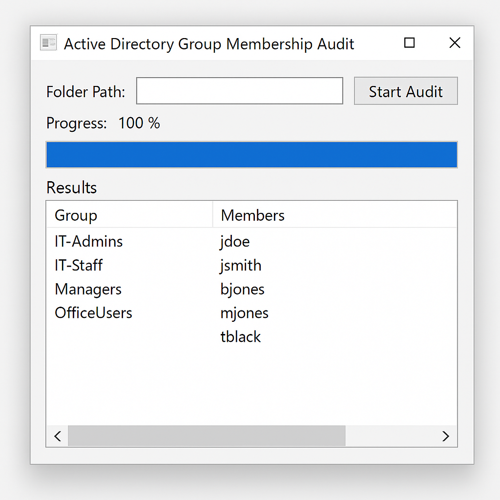

# PowerShell Audit Toolkit 🛠️

This repository contains a collection of PowerShell scripts designed to assist IT administrators with auditing Active Directory environments, improving password hygiene, and enhancing visibility into group memberships and access control.

---

## 📁 Scripts Included

### 1. `PasswordExpiryReminder.ps1`
Sends branded email reminders to users whose passwords will expire within the next 7 days.

**Features:**
- Automatically queries AD for users nearing password expiration.
- Filters out guest and disabled accounts.
- Sends customized HTML emails with step-by-step instructions and support contact info.

### 2. `PasswordExpiryReport.ps1`
Generates a CSV report of users whose passwords are expiring in the next 15 days.

**Features:**
- Filters out non-active and guest accounts.
- Saves results to a CSV file for review by IT staff.
- Ideal for regular audit tracking or compliance reporting.

### 3. `ADGroupAuditGUI.ps1`
A GUI-based PowerShell tool to audit group membership and display user associations across Active Directory groups.

**Features:**
- Windows Forms interface for ease of use.
- Threaded background scanning for large environments.
- Displays group-member relationships in a results box.

---

## 🔐 Redacted for Privacy
These scripts have been sanitized to remove:
- Internal domain names
- SMTP server details
- Production drive paths or user identifiers

You are encouraged to adapt these to your environment by replacing the placeholders with your real data.

---

## 📸 Screenshots

---

## 📄 License

This project is licensed under the MIT License. Feel free to use, modify, and distribute.

---

## 🙋‍♀️ Maintained by

PJ Piatt  
[LinkedIn Profile](https://www.linkedin.com/in/pj-piatt)
